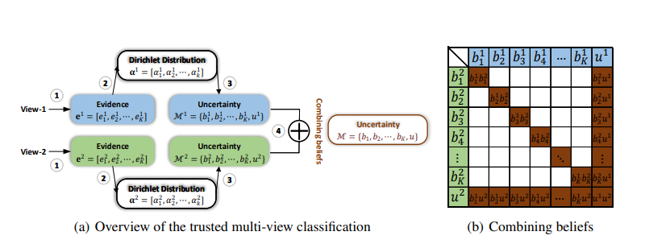

# TRUSTED MULTI-VIEW CLASSIFICATION

## 目录

- [1. 简介](#1)
- [2. 数据集和复现精度]()
- [3. 准备数据与环境]()
    - [3.1 准备环境]()
    - [3.2 准备数据]()
    - [3.3 准备模型]()
- [4. 开始使用]()
    - [4.1 模型训练]()
    - [4.2 模型评估]()
    - [4.3 模型预测]()
- [5. 模型推理部署]()
    - [5.1 基于Inference的推理]()
- [6. 自动化测试脚本]()
- [7. LICENSE]()
- [8. 参考链接与文献]()

<a id="1"></a>

## 1. 简介

​	   多视角分类（MVC）旨在通过使用不同视角的信息来提升分类的准确率，传统的方法是把多种信息集成到统一的表征空间里从而用到下游任务。然而为了提供可信的不确定性评估，从而判断预测结果是否可以被信任，需要动态评估不同视角下样本的可靠性。

​	   基于此，本文提出了新颖的多视角分类方法，旨在提供可信多视角分类的新范式，通过动态集成不同视角下证据的可信程度。该算法利用多个视角的证据来提升分类的可靠性和鲁棒性。

​		直接用softmax预测分类结果往往错误的类也有较高置信度，而本文首先用主观逻辑算法解决这问题，即用输出建模为狄利克雷分布来获取不同类的分配概率和不确定性（图a）

​		然后用Dempster Shafer证据理论将不同模态的概率进行动态组合（图b）。




**论文:** [TRUSTED MULTI-VIEW CLASSIFICATION](https://arxiv.org/abs/2102.02051)

**参考repo:** [TMC](https://github.com/hanmenghan/TMC)

在此非常感谢tmc repo的 hanmenghan等人贡献的[TMC](https://github.com/hanmenghan/TMC)，提高了本repo复现论文的效率。

**aistudio体验教程:** [地址](https://aistudio.baidu.com/aistudio/projectdetail/3763157)


## 2. 数据集和复现精度

- 数据集大小：该数据集包含从荷兰实用地图集合中提取的手写数字（“0”--“9”）的特征。每类 200 个图案（总共 2,000 个图案）已被数字化为二进制图像。
- 数据集下载链接：[**Multiple Features Data Set**](https://archive.ics.uci.edu/ml/datasets/Multiple+Features)
- 数据格式：该数据集每个样本包含六个特征：
  - mfeat-fou：字符形状的 76 个傅立叶系数；
  - mfeat-fac：216个剖面相关性；
  - mfeat-kar：64个Karhunen-Love系数；
  - mfeat-pix：2 x 3 窗口中的 240 像素平均值；
  - mfeat-zer：47 个 Zernike 时刻；
  - mfeat-mor：6个形态特征。
- 复现精度：（学习率设为0.003）

| Task               | Paper（ACC） | source code(ACC) | this repo(ACC) |
| ------------------ | ------------ | ---------------- | -------------- |
| handwritten_6views | 98.51+-0.15  | 98.25            | 98.25          |

模型的权重和日志如下所示（不用下载，repo里面有）：

链接：https://pan.baidu.com/s/1KgG6FOtufOiZiy2BWjFjcQ 
提取码：31z0

将model.pdparams放到output/model_best下就能使用默认的命令加载了。

## 3. 准备数据与环境


### 3.1 准备环境

首先介绍下支持的硬件和框架版本等环境的要求，格式如下：

- 硬件：GPU: Tesla V100 Mem 16GB, CPU 2cores RAM 16GB (aistudio高级GPU)
- 框架：
  - PaddlePaddle >= 2.2.0
- 使用如下命令安装依赖：

`pip install -r requirements.txt`

### 3.2 准备数据

由于数据量较小，已经放在repo里面了，路径如下所示：

```
# 全量数据： datasets/handwritten_6views.mat
# 少量数据（测试1条）： test_tipc/lite_data/tiny_sample.npy
```


### 3.3 准备模型


预训练模型默认保存到output/model_best下。


## 4. 开始使用

### 4.1 模型训练

```shell
# python
python train.py --data-path datasets/handwritten_6views \
                --batch-size 200 \
                --epochs 500 \
                --output-dir output \
# shell
bash scripts/train.py
```

```
2022-04-08 11:40:58,756 | TMC: global step 100/4000, epoch: 13, batch: 3, rank_id: 0, loss: 19.399559, lr: 0.0003000000, speed: 19.4923 step/s
2022-04-08 11:41:03,375 | TMC: global step 200/4000, epoch: 25, batch: 7, rank_id: 0, loss: 19.441984, lr: 0.0003000000, speed: 21.6644 step/s
2022-04-08 11:41:07,647 | TMC: global step 300/4000, epoch: 38, batch: 3, rank_id: 0, loss: 19.327517, lr: 0.0003000000, speed: 23.4114 step/s
2022-04-08 11:41:10,942 | TMC: global step 400/4000, epoch: 50, batch: 7, rank_id: 0, loss: 19.134670, lr: 0.0003000000, speed: 30.3596 step/s
2022-04-08 11:41:10,982 | TMC: eval loss: 18.905045, acc: 0.935, 
2022-04-08 11:41:10,983 | TMC: eval done total : 0.04038214683532715 s
2022-04-08 11:41:10,983 | TMC: 
```

### 4.2 模型评估

评估全量测试集：

```shell
python train.py --eval --model-path output/model_best/
```

### 4.3 模型预测

测试单条测试集

```shell
python predict.py --model-path output/model_best/
# shell
bash scripts/eval.sh
```

测试结果：

```
Load from ckpt output/model_best/ success.
test acc: 0.98, 
scores:[1.0000000e+00 6.9172846e-18 7.7700764e-18 7.1218232e-18 7.6900467e-18
 7.6770037e-18 8.4759775e-18 6.8646056e-18 1.3070486e-17 7.5873903e-18]
predicted_id: 0, prob: 1.0
```


## 5. 模型推理部署

### 5.1模型导出

```shell
bash scripts/export.sh
```

### 5.2 推理

```shell
bash scripts/infer.sh
```

结果与4.2动态图推理一致：

```
scores:[1.0000000e+00 6.9172722e-18 7.7700739e-18 7.1218299e-18 7.6900541e-18
 7.6770153e-18 8.4759750e-18 6.8646102e-18 1.3070502e-17 7.5873894e-18]
label_id: 0, prob: 1.0
```

## 6. 自动化测试脚本

tipc命令如下所示（具体文档请参照[test_train_inference_python.md](./test_tipc/docs/test_train_inference_python.md)）：

```shell
bash scripts/tipc.sh
# 或
bash test_tipc/test_train_inference_python.sh test_tipc/configs/TMC/train_infer_python.txt  lite_train_whole_infer
```


## 7. LICENSE

本项目的发布受[Apache 2.0 license](./LICENSE)许可认证。

## 8. 参考链接与文献

[1] [TRUSTED MULTI-VIEW CLASSIFICATION](https://arxiv.org/abs/2102.02051)

[2] [TMC github](https://github.com/hanmenghan/TMC)

[3] [天津大学韩宗博 - 兼听则明，信而有征：可信多模态分类](https://www.bilibili.com/video/BV1Ty4y1g76b?p=1&share_medium=android&share_plat=android&share_source=COPY&share_tag=s_i&timestamp=1623925652&unique_k=Gll8A1)
